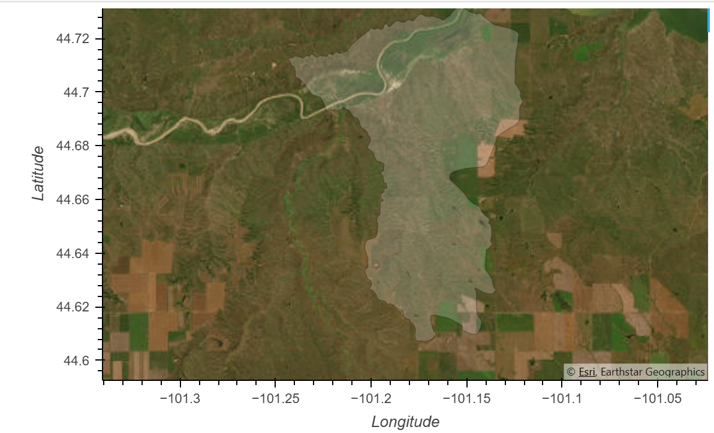
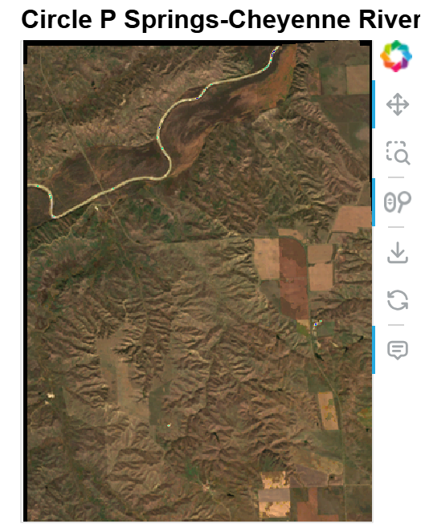
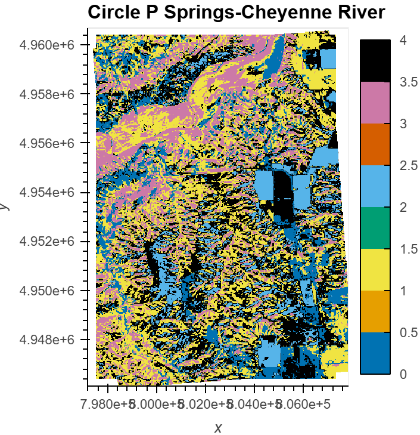

## Circle P Springs - Cheyenne River Watershed – Oglala Lakota, South Dakota

    
### Overview
The Cheyenne River Watershed, specifically the Circle P Springs–Cheyenne River HU12 subwatershed (HUC: 101301051402), is located in southwestern South Dakota within Oglala Lakota County on the Pine Ridge Reservation.
The watershed spans the mixed grass prairie ecoregion and lies within the larger Missouri River Basin, an essential drainage system for the central United States. The subwatershed includes segments of the Cheyenne River, 
which flows eastward across the Great Plains and eventually joins the Missouri River.
Wide riparian corridors, ephemeral tributaries, and rolling hills shape the landscape. Elevation ranges from approximately 3,000 to 4,000 feet, and the watershed supports rangeland, traditional food gathering sites, 
and culturally significant areas for the Oglala Lakota Nation. Hydrologically, this subwatershed is affected by seasonal precipitation, land use change, and infrastructure (e.g., roads, culverts), which may alter natural 
flow regimes and surface connectivity.
Due to its ecological and cultural importance, monitoring land cover and hydrological processes in this watershed is vital for sustainable land management, climate resilience, and community-led conservation.

